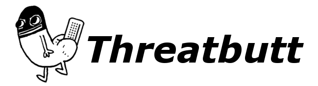

# 文系勉強会 vol.1 「サイバー攻撃のアトリビューション」

## 背景
パブリック・アトリビューションについては世界中で様々な試行錯誤がなされ、米国や英国を中心に各国が積極的な動きを見せている。国内でも、日本政府が本年4月と7月に中国政府を背景に持つサイバー攻撃グループに対する非難を実施した事例が注目を集めたが、パブリック・アトリビューションの概念は学術研究上も発展の途上にあり、実務上もこのプロセスをめぐり各国が目指す方向・道筋・産官学の役割分担などの未解決の課題と向き合う上で、技術・政治・法的な観点も踏まえた学際/業際的な議論が求められている

<!-- 一方で技術コミュニティには、この問題への諦めに似た感情が広がりつつある。技術的な証拠の積み重ねでは、十分な精度の攻撃者特定はできない。パブリック・アトリビューションのプロセスにおける技術的な分析は、結局は政治決定に上書きされる宿命にあるのではないかという諦めである。 -->

この勉強会では、この問題に向き合う3人の研究者を招き、それぞれ最近公開された論文をベースに、分析を発表していただき、政府・民間・アカデミアなど幅広いバックグラウンドを持つ専門家と議論を交わしていただく。国際法体系との整合性ある、技術的に正確な、パブリック・アトリビューションを行うにはどうしたらよいのか。それがこの勉強会の主たる問いである。

## 日時
日付: 9月14日 火曜日 (確定)  
時間: 16:00-18:00(確定)  

## 場所
以下のZoomを使用する。

> https://us02web.zoom.us/j/87636121088?pwd=VE5yaUdzSFlFbk5WYjdJWGpiYTJKUT09  
> ミーティングID: 876 3612 1088  
> パスコード: dM0cR0  

## プログラム

### 16:00-16:30 発表者1: 瀬戸 崇志(防衛研究所)
論文: [瀬戸崇志. 2021. “国家のサイバー攻撃とパブリック・アトリビューション: ファイブ・アイズ諸国のアトリビューション連合とSolarWinds事案対応.” NIDSコメンタリー 179.](http://www.nids.mod.go.jp/publication/commentary/pdf/commentary179.pdf)    

### 16:30-17:00 発表者2: 佐々木 勇人(JPCERT/CC) 
論文: 佐々木勇人. 2021. “パブリックアトリビューションの課題 ― 大規模なサイバー攻撃や 国際的イベントへのサイバー攻撃事例から―.” CISTECジャーナル (194): 130–38.  

### 17:00-17:30 発表者3: 清水 翔(防衛大学校総合安全保障研究科)
論文: [清水翔. 2020. “国家間サイバー攻撃の法的アトリビューション—国際司法裁判所における「証拠偏在」論の再構成—.” 情報ネットワーク・ローレビュー 19: 121–33.](https://www.jstage.jst.go.jp/article/inlaw/19/0/19_190007/_article/-char/ja)  
レジュメ: [ダウンロード](./清水レジュメ.docx)  

### 17:30-18:00 全体を通した質疑応答
進行: 持永大

### プログラムに関連する諸注意
- 時間配分としては全体として1時間半を想定しています。発表者の3名はそれぞれ20分の発表をお願いします。その後に10分のQAセッションを行います。最後に30分の全体での議論の時間をとります。
- 本会合の詳細な記録などは作成せず、会合の内容はチャタムハウスルールに基づいて、発言者を特定する情報を落として共有をお願いします。
- クローズドなイベントですが、発表者は機微な内容などを発表に含めないよう配慮ください。

## 参加者リスト
会議の参加者は以下の通りです。適宜更新します。順不同、敬称略。

- 瀬戸崇志
- 清水翔
- 茂木隆宏
- 持永大
- 佐々木勇人
- 小宮山功一朗
- 上田格
- 川口貴久

<!-- 誘おうと思っている人:
片山健(Toyota)
小泉悠(東大)
川口 貴久(東京海上日動リスクコンサルティング)
長迫さん(笹川)
上田さん(NEC)
その他複数。今回テーマ的に霞が関をいれると口が重くなってしまうのを懸念。 -->

## 問い合わせ
小宮山功一朗  
*komiyamaアットGメールドットコム*  

	

